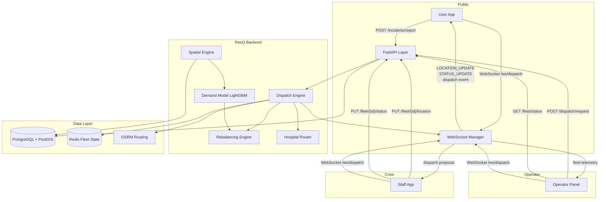
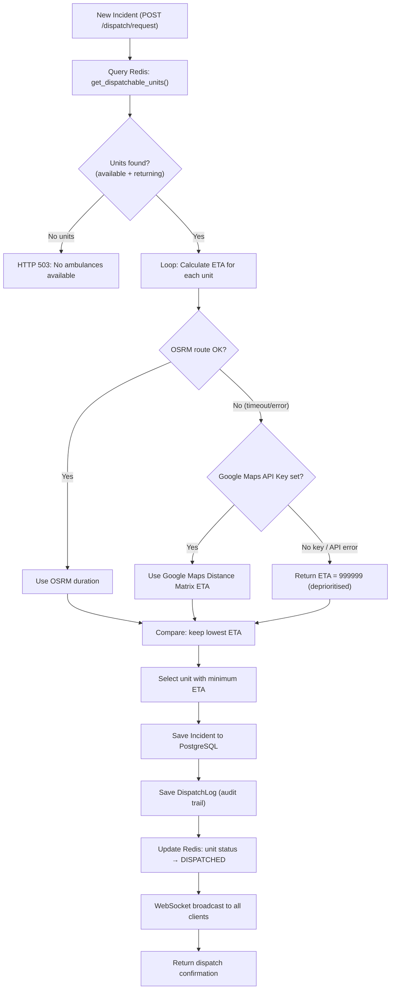
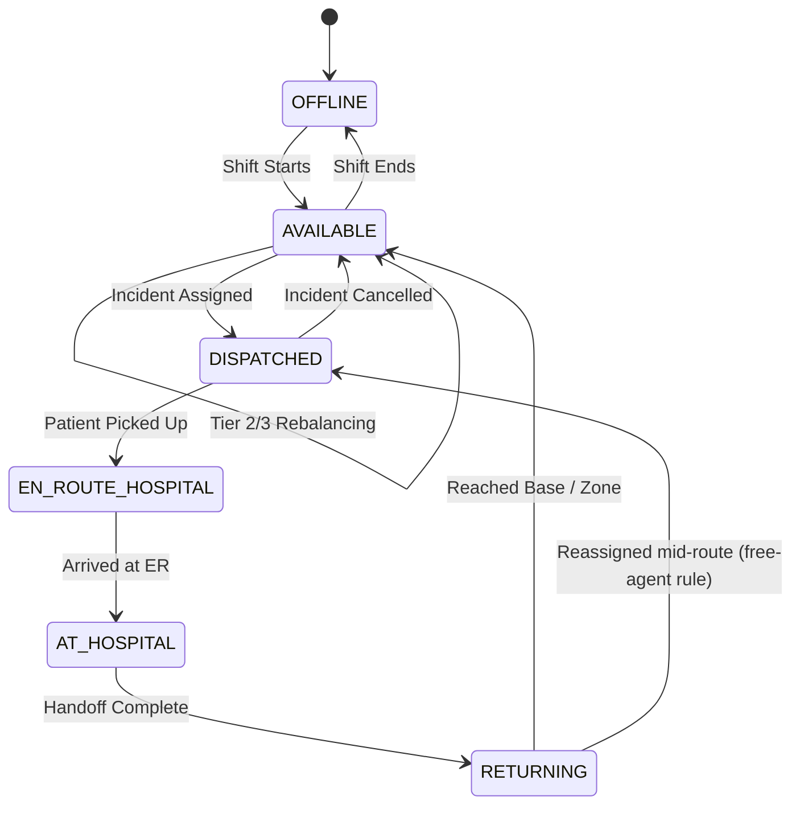
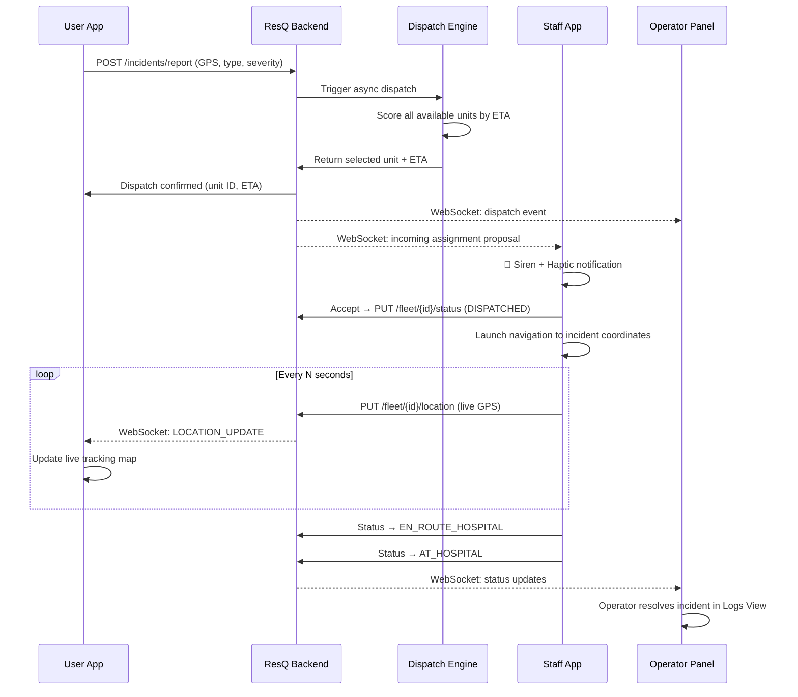
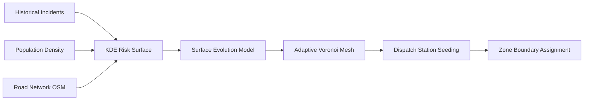
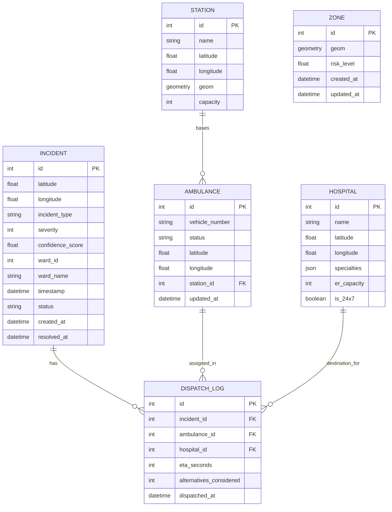

<div align="center">


# Res**Q**

### AI-Native Dispatch Optimisation Engine for Urban Emergency Medical Services

*Replacing proximity-based dispatch with real-time ETA minimisation across an entire ambulance fleet*

---

[](https://python.org)
[](https://fastapi.tiangolo.com)
[](https://reactnative.dev)
[](https://expo.dev)
[](https://react.dev)
[](https://typescriptlang.org)
[](https://postgis.net)
[](LICENSE)
[]()

</div>

---

## The Problem

The standard ambulance dispatch protocol is **proximity dispatch** — send the nearest available unit. It sounds right. It is not.

The nearest unit by straight-line distance is rarely the unit with the shortest arrival time. Road network geometry, live traffic, unit heading, and post-handoff positioning all create systematic gaps between "nearest" and "fastest." In a city like Bengaluru — with its ORR corridor, Silk Board junction, one-ways, and radial congestion — these gaps translate directly into lives.

Academic literature on optimised EMS dispatch reports response time reductions of **up to 42%** over nearest-unit approaches in urban simulation (Zarkeshzadeh et al., 2015). ResQ targets improvements at the upper end of this range.

---

## What ResQ Does

ResQ is a full-stack emergency dispatch system built across four components:

| Component | What It Is |
|---|---|
| **Backend** | AI dispatch engine: ETA-based unit selection, spatial demand forecasting, three-tier fleet rebalancing, hospital routing |
| **Operator Panel** | Web-based command dashboard for 108 dispatch operators: live fleet map, dispatch wizard, incident management |
| **User App** | Public-facing mobile app (iOS/Android): SOS submission, live ambulance tracking, hospital recommendations |
| **Staff App** | On-device app for ambulance crews: shift management, dispatch assignment acceptance, incident lifecycle, GPS telemetry |

---

## System Architecture

```
┌──────────────────────────────────────────────────────────────────────────────┐
│                              ResQ Platform                                   │
│                                                                              │
│  ┌─────────────────┐   ┌──────────────────┐   ┌──────────────────────────┐  │
│  │   User App      │   │   Staff App      │   │   Operator Panel         │  │
│  │  (React Native) │   │  (React Native)  │   │   (React + Vite)         │  │
│  │                 │   │                  │   │                          │  │
│  │  • SOS submit   │   │  • Shift start   │   │  • Live fleet map        │  │
│  │  • Live track   │   │  • Dispatch recv │   │  • Dispatch wizard       │  │
│  │  • Hospital rec │   │  • GPS telemetry │   │  • Incident audit log    │  │
│  └────────┬────────┘   └───────┬──────────┘   └────────────┬─────────────┘  │
│           │                    │                            │                │
│           └──────────────────┬─┴────────────────────────────┘                │
│                              │ REST + WebSocket                              │
│                    ┌─────────▼─────────────────────┐                         │
│                    │       FastAPI Layer             │                        │
│                    │   /dispatch  /fleet  /hospital  │                        │
│                    │   /incidents /zones  /mesh      │                        │
│                    │   /ws/dispatch (WebSocket)      │                        │
│                    └─────────┬─────────────────────┘                         │
│                              │                                               │
│           ┌──────────────────┼────────────────────────┐                      │
│           │                  │                        │                      │
│  ┌────────▼──────┐  ┌────────▼────────┐  ┌───────────▼───────┐              │
│  │  Dispatch     │  │  Spatial        │  │  Hospital         │              │
│  │  Engine       │  │  Engine         │  │  Router           │              │
│  │               │  │                 │  │                   │              │
│  │  ETA compute  │  │  KDE surface    │  │  Rank by ETA,     │              │
│  │  Unit select  │  │  Voronoi mesh   │  │  specialty,       │              │
│  │  Free-agent   │  │  Risk surface   │  │  capacity         │              │
│  └────────┬──────┘  └────────┬────────┘  └───────────┬───────┘              │
│           │                  │                        │                      │
│  ┌────────▼──────┐  ┌────────▼────────┐               │                     │
│  │ Rebalancing   │  │  Demand         │               │                     │
│  │ Engine        │  │  Surface (ML)   │               │                     │
│  │               │  │                 │               │                     │
│  │  Tier 1/2/3   │  │  LightGBM ERT   │               │                     │
│  └────────┬──────┘  └────────┬────────┘               │                     │
│           │                  │                        │                      │
│           └──────────────────┼────────────────────────┘                      │
│                              │                                               │
│                  ┌───────────┼───────────┐                                   │
│                  │           │           │                                   │
│            ┌─────▼──┐  ┌────▼────┐  ┌───▼──────┐                           │
│            │PostGIS │  │ Redis   │  │  OSRM    │                           │
│            │(spatial│  │(fleet   │  │(routing  │                           │
│            │  data) │  │ state)  │  │ engine)  │                           │
│            └────────┘  └─────────┘  └──────────┘                           │
└──────────────────────────────────────────────────────────────────────────────┘
```

---

## Full System Pipeline



---

## Core Engine: Dispatch Logic



---

## Ambulance State Machine



---

## Incident Lifecycle (End-to-End)



---

## Spatial Engine

ResQ models the city as a **dynamic probabilistic risk landscape** rather than a static map.

**Stage 1 — Risk Surface Generation**

Builds a continuous probability surface using kernel density estimation (KDE) — no fixed distribution assumed. Inputs: historical incident records, population density, road network topology, points of interest (tech parks, malls, stadiums), and temporal patterns.

**Stage 2 — Surface Evolution Prediction**

A LightGBM model predicts how the risk surface shifts over the next N minutes based on live traffic, time-of-day patterns, ongoing incidents, and historical shift patterns at equivalent timestamps.

**Stage 3 — Adaptive Voronoi Mesh Generation**

Both surfaces feed into a constrained mesh generator that drapes an irregular polygon mesh over the risk landscape:
- High-risk zones → small, dense polygons (maximum response density)
- Low-risk zones → large, sparse polygons (efficient resource distribution)
- Mesh stitched to physical geography: rivers, flyovers, one-ways, administrative boundaries



---

## Fleet Rebalancing Engine

Fleet distribution drifts through a shift as units are dispatched. Three concurrent tiers correct this continuously without blocking dispatch.

| Tier | Trigger | Action |
|---|---|---|
| **Tier 1 — Urgent** | Zone reaches zero units | Immediate pull from nearest surplus station. Coverage over efficiency. |
| **Tier 2 — Scheduled** | Every N hours | Optimisation pass against predicted demand. Units move only if ERT gain exceeds relocation cost. |
| **Tier 3 — Passive** | Post-handoff unit return | Unit routes to highest-demand station rather than home base. Zero added overhead. |

**Objective Function — Expected Response Time (ERT):**

```
ERT = Σ P(i) × T(i)
```

- `P(i)` — predicted probability of an incident in zone i
- `T(i)` — travel time from the nearest available unit to zone i

Every engine decision that reduces ERT is correct. Every decision that increases it is not.

---

## Hospital Router

Nearest hospital ≠ best hospital. On every dispatch, candidate hospitals are ranked by:

1. Real-time traffic ETA
2. Specialty match: **TRAUMA**, **CARDIAC**, **BURNS**, **NEURO**, **GENERAL**
3. Current ER capacity and operational status
4. 24/7 availability

Top recommendation + 2–3 alternatives are surfaced to the ambulance crew. Crew retains final authority and can override at any time. All overrides are logged and feed back into hospital weighting.

---

## Database Schema



---

## Repository Structure

```text
ResQ/
│
├── ResQ/
│   │
│   ├── ResQ_backend-main/          # FastAPI backend: dispatch, spatial, ML, hospital routing
│   │   └── ResQ_backend-main/
│   │       ├── app/
│   │       │   ├── api/            # Route definitions (dispatch, fleet, hospital, incidents, zones)
│   │       │   ├── core/           # Business logic (dispatch engine, rebalancing, routing)
│   │       │   ├── db/             # ORM models, migrations (Alembic)
│   │       │   ├── ml/             # LightGBM demand model
│   │       │   └── spatial/        # KDE risk surface, Voronoi mesh generator
│   │       ├── scripts/            # Data seeding, OSM loading, model retraining
│   │       ├── tests/              # 44 Pytest tests, 81% coverage
│   │       └── README.md
│   │
│   ├── ResQ_User_Frontend/         # Public mobile app (Expo / React Native)
│   │   ├── app/                    # Expo Router screens (Home, Track, History, Settings)
│   │   ├── components/             # SOS button, tracking sheet, hospital card
│   │   ├── hooks/                  # useLocation, useIncident, useAmbulanceTracking
│   │   ├── store/                  # Zustand global state
│   │   └── README.md
│   │
│   ├── resq-staff-expo/            # Crew mobile app (Expo / React Native)
│   │   ├── src/
│   │   │   └── components/         # Onboarding, Home, ActiveIncident, Hospitals, History
│   │   ├── App.tsx                 # Root: shift state, WebSocket, GPS telemetry, handlers
│   │   └── README.md
│   │
│   ├── remix_-resq-operator-panel/ # Web dispatch dashboard (React + Vite)
│   │   ├── src/
│   │   │   ├── components/         # MapView (Leaflet), FleetView, LogsView, DispatchForm
│   │   │   └── utils/              # Backoff logic, types
│   │   └── README.md
│   │
│   └── docker-compose.yml          # Docker orchestration
│
├── .gitignore
└── README.md                       # ← You are here
```

---

## Tech Stack

| Layer | Technology |
|---|---|
| **Backend API** | Python 3.11, FastAPI, Uvicorn |
| **Database** | PostgreSQL 15 + PostGIS 3.4 |
| **Fleet State Cache** | Redis |
| **Routing Engine** | OSRM (offline), Google Maps / HERE (live fallback) |
| **ML / Demand Model** | LightGBM |
| **Spatial Processing** | OSMnx, Shapely, SciPy KDE |
| **User App** | React Native 0.81, Expo 54, Expo Router, Zustand, NativeWind |
| **Staff App** | React Native 0.81, Expo 54, NativeWind, Lucide |
| **Operator Panel** | React 19, Vite 6, TypeScript, Leaflet, Tailwind CSS |
| **Real-Time** | WebSocket (native FastAPI + browser/RN clients) |
| **Testing** | Pytest (44 tests, 81% coverage), Vitest |
| **Container** | Docker + Docker Compose |

---

## Getting Started

### Prerequisites

- Python 3.11+
- Node.js 18+
- Docker + Docker Compose
- Expo Go (for mobile apps on physical devices)

### 1. Start the Backend

```bash
cd ResQ/ResQ_backend-main/ResQ_backend-main
python -m venv venv
source venv/bin/activate        # Windows: .\venv\Scripts\activate
pip install -r requirements.txt
cp .env.example .env
# Edit .env with your DATABASE_URL, REDIS_URL, OSRM_BASE_URL
uvicorn app.main:app --reload
```

Seed the database with synthetic Bengaluru data:

```bash
python scripts/generate_synthetic_incidents.py
python scripts/reseed_all.py
```

### 2. Start the Operator Panel

```bash
cd ResQ/remix_-resq-operator-panel
npm install
cp .env.example .env
npm run dev
# Runs on http://localhost:3000
```

### 3. Run the User App

```bash
cd ResQ/ResQ_User_Frontend
npm install
npm start
# Scan QR with Expo Go on your phone
```

### 4. Run the Staff App

```bash
cd ResQ/resq-staff-expo
npm install
npm start
# Scan QR with Expo Go on your phone
# Enable Mock Mode at onboarding to run without live backend
```

### Environment Variables (Backend)

| Variable | Description | Required |
|---|---|---|
| `DATABASE_URL` | PostgreSQL + PostGIS connection string | Yes |
| `REDIS_URL` | Redis connection string | Yes |
| `OSRM_BASE_URL` | OSRM server URL | Yes |
| `GOOGLE_MAPS_API_KEY` | Routing fallback (live traffic) | No |
| `APP_ENV` | `development` / `production` | No |

---

## API Reference

| Method | Endpoint | Description |
|---|---|---|
| `POST` | `/dispatch/request` | Submit incident, trigger automatic ETA dispatch |
| `GET` | `/dispatch/history` | Fetch dispatch audit log |
| `POST` | `/incidents/report` | Report an incident (from user app / operator) |
| `PUT` | `/fleet/{id}/location` | Push GPS coordinates for an ambulance |
| `PUT` | `/fleet/{id}/status` | Change ambulance status |
| `GET` | `/fleet/status` | Get real-time fleet state from Redis |
| `GET` | `/hospital/list` | List all registered hospitals |
| `GET` | `/hospital/recommend` | Ranked hospitals by ETA, specialty, capacity |
| `GET` | `/api/dispatch-centers` | Dispatch centres with live fleet counts (map overlay) |
| `GET` | `/api/mesh` | KNN mesh links between centres (map overlay) |
| `GET` | `/zones/mesh` | Current Voronoi zone mesh (GeoJSON) |
| `POST` | `/zones/generate` | Trigger full risk surface + mesh regeneration |
| `GET` | `/zones/risk-surface` | KDE risk surface at a grid resolution |
| `WS` | `/ws/dispatch` | Real-time: location updates, status changes, dispatch events |

---

## Data Sources

| Signal | Source | Refresh |
|---|---|---|
| Historical incidents | Bengaluru Traffic Police / RTI / public records | Periodic |
| Road network | OpenStreetMap via OSMnx | Periodic |
| Offline routing | OSRM on cached Bengaluru road graph | Every 15 minutes |
| Population density | Census of India | Annual |
| Live traffic | Google Maps Platform / HERE Maps API | Real-time |
| Hospital capacity | Manual entry + API where available | Near real-time |
| Weather | OpenWeatherMap API | Real-time |
| Points of interest | OpenStreetMap / Google Places | Periodic |

---

## Deployment Target: Bengaluru

Bengaluru is the primary deployment target — not because it is easy, but because it is among the hardest urban road networks in India to optimise ETA dispatch on. The ORR corridor, Silk Board junction, Hebbal flyover, and inner-city density represent a genuine stress test. If ResQ works in Bengaluru, it works anywhere.

**Future expansion:** Hyderabad, Chennai, Mumbai, Delhi-NCR.

---

## Testing

```bash
# Backend — run all tests
cd ResQ/ResQ_backend-main/ResQ_backend-main
pytest tests/ -v

# Backend — with coverage report
pytest tests/ --cov=app --cov-report=term-missing

# Operator Panel — utility tests
cd ResQ/remix_-resq-operator-panel
npm run test
```

**Current status:** 44 backend tests passing, 81% code coverage across `app/`.

---

## Research Foundation

- Zarkeshzadeh et al. (2015) — ETA-optimised dispatch demonstrates up to 42% response time reduction over nearest-unit methods in urban simulation
- Nakada et al. (2024) — Fleet rebalancing interventions produce statistically significant response time reductions in urban EMS systems

---

## Accountability

ResQ is a logistics and routing coordination layer. All medical decisions are made exclusively by licensed professionals — ambulance crew in the field and hospital staff on arrival. ResQ is accountable for its algorithm and its technology. Clinical outcomes are outside its domain.

Every dispatch decision is logged with timestamp, unit selected, ETA computed, all alternatives considered, and outcome. The system never makes an undocumented decision.

---

## Team

| Name | USN | Role |
|---|---|---|
| Akshat Kumar Jha | 1WA24CS031 | Backend Core, Spatial Engine, ML Pipeline, System Architecture |
| Aditya Dadheech | 1WA24CS018 | Backend, ML Pipeline, Data Pipeline, Incident Data Sourcing |
| Arush Mandhan | 1WA24CS054 | Frontend Core, API Integration, Interaction & Response Engineering |
| Aryan Surya K.S | 1WA24CS060 | Frontend, API Integration, Interaction & Response Engineering, Logo Design |

*B.M.S. College of Engineering, Dept. of Computer Science & Engineering, Bengaluru*
*Mobile Application Development — Semester 4, 2026*

---

## Roadmap

### Backend
- [x] Bengaluru OSM road network loading
- [x] Historical incident data pipeline
- [x] KDE risk surface generation
- [x] Surface evolution prediction (LightGBM)
- [x] Adaptive Voronoi mesh generation
- [x] ETA dispatch engine
- [x] Three-tier rebalancing engine
- [x] Hospital routing engine
- [x] FastAPI layer + WebSocket
- [x] Simulation validation over Bengaluru incident data
- [ ] Live deployment trial
- [ ] Reinforcement learning rebalancing calibration
- [ ] BBMP traffic signal integration

### Operator Panel
- [x] Live Leaflet map with GPS-tracked ambulance markers
- [x] WebSocket telemetry with exponential backoff reconnection
- [x] Dispatch wizard with backend API integration
- [x] Mid-route unit swap (Intervention mode)
- [x] Operations journal with real-time event stream
- [ ] Voronoi zone mesh overlay
- [ ] Demand surface heat-map

### User App
- [x] SOS button (tap → 108 dialer, long press → App SOS)
- [x] "Call for Someone Else" dispatch flow
- [x] Incident type and severity selection
- [x] Live ambulance tracking map
- [x] Hospital recommendation on dispatch
- [ ] Push notifications on ambulance arrival
- [ ] Offline SOS queue

### Staff App
- [x] Shift onboarding with persistent state
- [x] Real-time dispatch proposal modal (siren + haptic)
- [x] Five-stage incident lifecycle management
- [x] OSRM real road route with synthetic fallback
- [x] Hospital ranking and override logging
- [x] Live GPS telemetry push
- [x] Mock mode for training and demos
- [ ] Background push notifications
- [ ] Offline incident paperwork queue

---

<div align="center">

*ResQ is in active development. Contributions, feedback, and questions welcome.*

</div>
