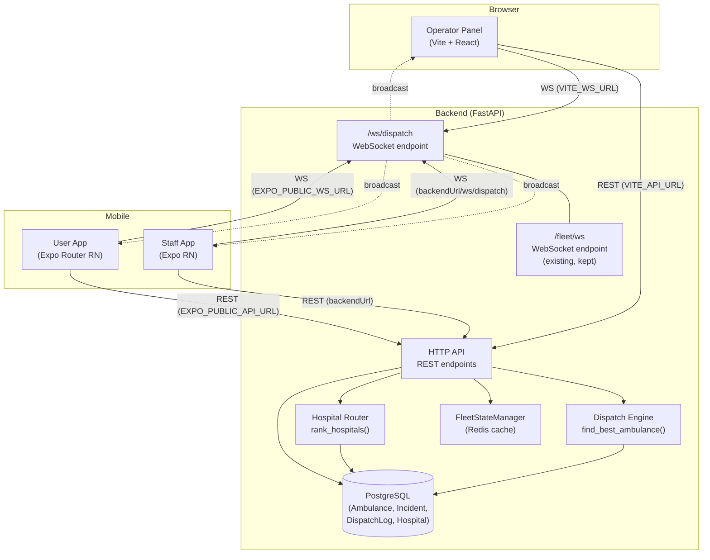
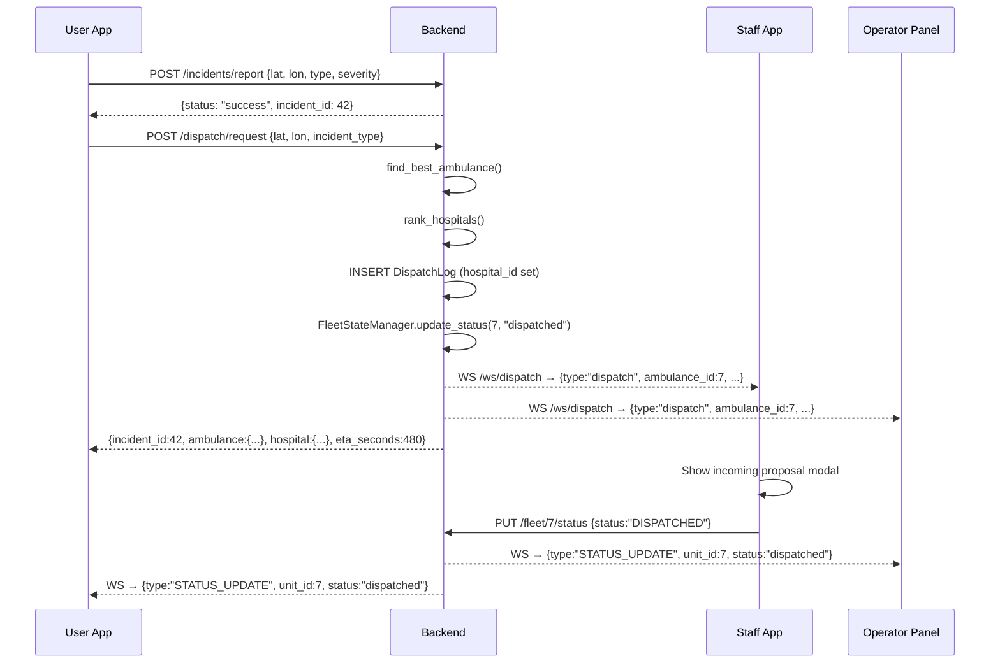
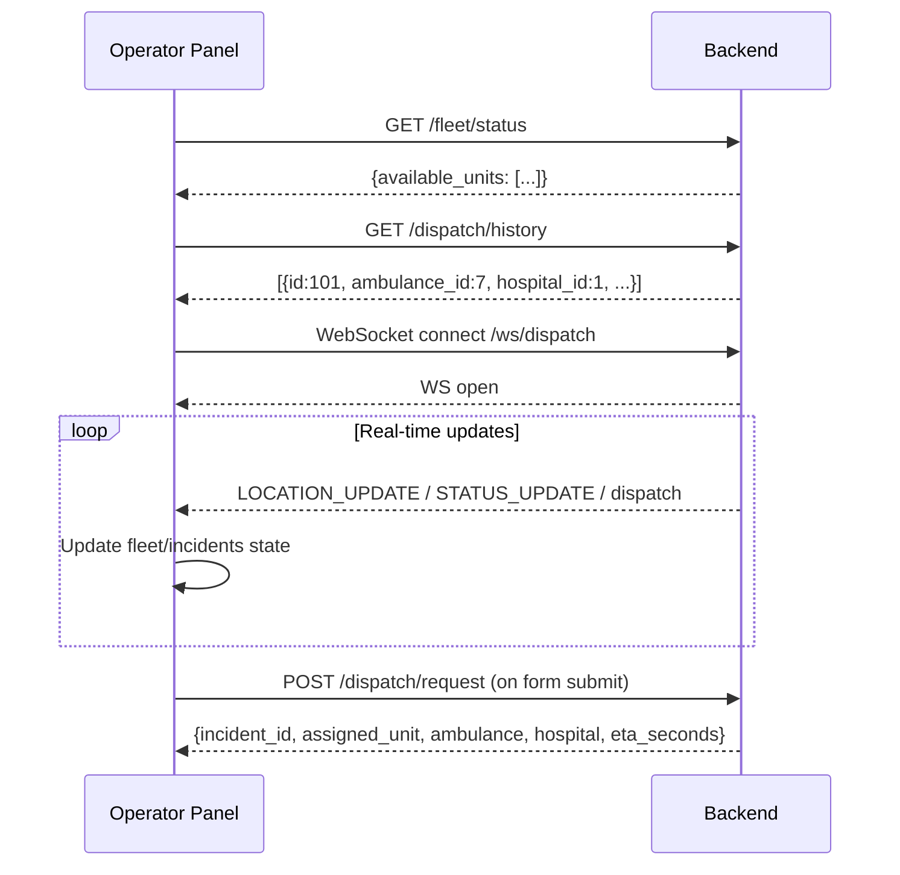

# Design Document — ResQ System Integration

## Overview

This document describes the technical design for correcting all broken API contracts and missing functionality across the four ResQ applications so the full system operates correctly when deployed together.

The changes fall into three broad categories:

1. **Backend additions / fixes** — new `/ws/dispatch` WebSocket endpoint, expanded `POST /dispatch/request` response, `hospital_id` population in `DispatchLog`, `ambulance_id` filtering on dispatch history, lat/lon overload for hospital recommendation, status casing normalisation, and CORS env-var configuration.
2. **Client contract fixes** — Staff App HTTP method corrections and response-shape alignment; User App field-name fix and mock-mode bug fix.
3. **Operator Panel backend integration** — replace all hardcoded state with live API calls and a real WebSocket connection.

No database schema migrations are required — the `hospital_id` column already exists as a nullable FK on `dispatch_log`, and all other changes are in application logic.

---

## Architecture



### Connection Flow

1. **Operator Panel** connects on startup: fetches fleet status, dispatch history, and opens a WebSocket to `VITE_WS_URL` (`/ws/dispatch`).
2. **Staff App** connects a WebSocket to `{backendUrl}/ws/dispatch` when a shift starts. GPS and status updates go to `PUT /fleet/{unitId}/location` and `PUT /fleet/{unitId}/status`.
3. **User App** opens a WebSocket to `EXPO_PUBLIC_WS_URL` when an active incident exists. Incident reporting flows through `POST /incidents/report` → `POST /dispatch/request`.
4. **Backend** broadcasts all dispatch and location/status events to every client connected on `/ws/dispatch`.

---

## Components and Interfaces

### Backend Components

#### 1. `/ws/dispatch` WebSocket Endpoint (new)

**File:** `ResQ_backend-main/app/main.py` (or a new `app/api/ws.py` router)

The existing `ConnectionManager` at `app/core/websocket_manager.py` already handles connection pooling and broadcast. The only missing piece is a FastAPI WebSocket route mounted at `/ws/dispatch`.

```python
# app/api/ws.py  (new file)
from fastapi import APIRouter, WebSocket, WebSocketDisconnect
from app.core.websocket_manager import manager

ws_router = APIRouter(tags=["WebSocket"])

@ws_router.websocket("/ws/dispatch")
async def dispatch_websocket_endpoint(websocket: WebSocket):
    await manager.connect(websocket)
    try:
        while True:
            await websocket.receive_text()   # keep alive; clients may send pings
    except WebSocketDisconnect:
        manager.disconnect(websocket)
```

The existing `/fleet/ws` endpoint remains as-is.

#### 2. `PUT /fleet/{unit_id}/status` — Casing Normalisation

**File:** `ResQ_backend-main/app/api/fleet.py`

```python
@fleet_router.put("/{unit_id}/status")
async def update_fleet_status(unit_id: int, status_update: StatusUpdate, ...):
    normalised = status_update.status.strip().lower()
    # Validate against enum
    valid = {s.value for s in AmbulanceStatus}
    if normalised not in valid:
        raise HTTPException(status_code=422, detail=f"Unknown status: '{normalised}'")
    FleetStateManager.update_status(unit_id=unit_id, status=normalised)
    await manager.broadcast({"type": "STATUS_UPDATE", "unit_id": unit_id, "status": normalised})
    ...
```

All status values stored in Redis and returned in responses use lowercase enum values.

#### 3. `POST /dispatch/request` — Expanded Response + Hospital Assignment

**File:** `ResQ_backend-main/app/api/dispatch.py`

New logic after selecting `best_unit_id`:
1. Query the `Ambulance` row for `best_unit_id` from PostgreSQL.
2. Invoke `rank_hospitals()` with the incident coordinates and `incident_type` as `required_specialty`.
3. Take the first result (if any) as the assigned hospital.
4. Write `hospital_id` on the `DispatchLog`.
5. Broadcast a `"dispatch"` message (not just `"STATUS_UPDATE"`) to `/ws/dispatch` with the full objects.
6. Return the expanded response shape.

```python
# Expanded response shape
return {
    "message": "Dispatch successful",
    "incident_id": new_incident.id,
    "assigned_unit": best_unit_id,
    "eta_seconds": best_eta,
    "ambulance": {
        "id": ambulance.id,
        "vehicle_number": ambulance.vehicle_number,
        "latitude": ambulance.latitude,
        "longitude": ambulance.longitude,
        "status": ambulance.status.value   # lowercase
    },
    "hospital": hospital_dict or None      # full hospital object or null
}
```

#### 4. `GET /hospital/recommend` — lat/lon Overload

**File:** `ResQ_backend-main/app/api/hospital.py`

Change the signature so both `incident_id` and `lat`/`lon`/`incident_type` are optional, with a mutual-exclusion validation guard:

```python
@hospital_router.get("/recommend")
async def get_hospital_recommended(
    incident_id: Optional[int] = Query(None),
    lat: Optional[float] = Query(None),
    lon: Optional[float] = Query(None),
    incident_type: Optional[str] = Query(None),
    required_specialty: Optional[str] = Query(None),
    db: Session = Depends(get_db)
):
    if incident_id is not None:
        # existing path — prefer incident_id
        incident = db.query(Incident).filter(Incident.id == incident_id).first()
        if not incident:
            raise HTTPException(status_code=404, detail="Incident not found")
        lookup_lat, lookup_lon = incident.latitude, incident.longitude
        specialty = required_specialty or incident.incident_type
        response_incident_id = incident.id
    elif lat is not None and lon is not None:
        # new path — use provided coordinates
        lookup_lat, lookup_lon = lat, lon
        specialty = incident_type or required_specialty
        response_incident_id = None
    else:
        raise HTTPException(status_code=422, detail="Provide incident_id or lat+lon+incident_type")

    ranked = await rank_hospitals(lookup_lat, lookup_lon, specialty, db)
    result = {"recommendations": ranked}
    if response_incident_id is not None:
        result["incident_id"] = response_incident_id
    return result
```

#### 5. `GET /dispatch/history` — ambulance_id Filter + hospital_name Join

**File:** `ResQ_backend-main/app/api/dispatch.py`

```python
@dispatch_router.get("/history")
def get_dispatch_history(
    ambulance_id: Optional[int] = Query(None),
    db: Session = Depends(get_db)
):
    query = db.query(DispatchLog)
    if ambulance_id is not None:
        query = query.filter(DispatchLog.ambulance_id == ambulance_id)
    logs = query.order_by(DispatchLog.dispatched_at.desc()).limit(50).all()
    # Enrich with hospital_name
    result = []
    for log in logs:
        row = {
            "id": log.id,
            "incident_id": log.incident_id,
            "ambulance_id": log.ambulance_id,
            "hospital_id": log.hospital_id,
            "eta_seconds": log.eta_seconds,
            "alternatives_considered": log.alternatives_considered,
            "dispatched_at": log.dispatched_at.isoformat(),
            "hospital_name": None
        }
        if log.hospital_id:
            h = db.query(Hospital).filter(Hospital.id == log.hospital_id).first()
            row["hospital_name"] = h.name if h else None
        result.append(row)
    return result
```

#### 6. CORS Configuration

**File:** `ResQ_backend-main/app/main.py`

```python
import os

raw_origins = os.getenv("ALLOWED_ORIGINS", "")
if raw_origins.strip():
    allow_origins = [o.strip() for o in raw_origins.split(",") if o.strip()]
else:
    allow_origins = ["*"]   # development default

app.add_middleware(
    CORSMiddleware,
    allow_origins=allow_origins,
    allow_credentials=True,
    allow_methods=["*"],
    allow_headers=["*"],
)
```

### Staff App Changes

**File:** `resq-staff-expo/App.tsx`

1. **HTTP method fix** — Change all `method: "POST"` location/status fetch calls to `method: "PUT"`.
2. **Fleet status response** — `handleRefreshFleet`: read `data.available_units` instead of checking `Array.isArray(data)`.
3. **History filtering** — `HistoryScreen` needs to pass `?ambulance_id={unitId}` when `filterMode === "mine"` and omit the param when `filterMode === "all"` (also fix the URL construction in `HistoryScreen.tsx`).

**File:** `resq-staff-expo/src/components/HistoryScreen.tsx`

```typescript
const url = filterMode === "mine"
  ? `${backendUrl}/dispatch/history?ambulance_id=${unitId}`
  : `${backendUrl}/dispatch/history`;
const response = await fetch(url);
const data = await response.json();
if (Array.isArray(data)) setHistory(data);
```

**File:** `resq-staff-expo/src/components/ActiveIncidentScreen.tsx`

```typescript
// Stage 3 hospital fetch — use lat/lon/incident_type params
const response = await fetch(
  `${backendUrl}/hospital/recommend?lat=${lat}&lon=${lon}&incident_type=${type}`
);
const data = await response.json();
if (data.recommendations && data.recommendations.length > 0) {
  setHospitalsList(data.recommendations);
  ...
}
```

### User App Changes

**File:** `ResQ_User_Frontend/constants/config.ts`

```typescript
export const config = {
  apiBaseUrl: process.env.EXPO_PUBLIC_API_URL || 'http://localhost:8000',
  wsUrl: process.env.EXPO_PUBLIC_WS_URL || 'ws://localhost:8000/ws/dispatch',
  nominatimUrl: process.env.EXPO_PUBLIC_NOMINATIM_URL || 'https://nominatim.openstreetmap.org',
  mockModeDefault: process.env.EXPO_PUBLIC_MOCK_MODE === 'true',  // removed || true
}
```

**File:** `ResQ_User_Frontend/store/appStore.ts`

```typescript
import { config } from '../constants/config';
// ...
mockMode: config.mockModeDefault,   // was hardcoded false
```

**File:** `ResQ_User_Frontend/hooks/useIncident.ts`

```typescript
// Fix 1: use incident_id not id
const incidentId = reportRes.data.incident_id;   // was reportRes.data.id

// Fix 2: store incidentId with correct value immediately
setActiveIncident({
  incidentId,   // correct value now
  ...
});
```

### Operator Panel Changes

**File:** `remix_-resq-operator-panel/src/App.tsx`

Replace hardcoded `INITIAL_FLEET_UNITS` / `INITIAL_INCIDENTS` loading with API calls on mount, and connect a WebSocket for real-time updates.

New state additions:
- `apiBaseUrl` — read from `import.meta.env.VITE_API_URL || 'http://localhost:8000'`
- `wsUrl` — read from `import.meta.env.VITE_WS_URL || 'ws://localhost:8000/ws/dispatch'`
- `wsConnected: boolean`
- `backendWarning: string | null`

New hooks/effects:
1. `useEffect` on mount to fetch fleet, history, dispatch centers, mesh
2. `useEffect` on mount to open WebSocket and handle `LOCATION_UPDATE` / `STATUS_UPDATE` / `dispatch` messages with exponential-backoff reconnect
3. Updated `handleDispatchSubmit` to call `POST /dispatch/request`
4. Updated `handleModifyStatus` to call `PUT /fleet/{id}/status`

---

## Data Models

### Existing Models (unchanged)

The database schema requires no migration. All changes are in application logic.

```
DispatchLog
  id               INTEGER PK
  incident_id      INTEGER FK → incident.id
  ambulance_id     INTEGER FK → ambulance.id
  hospital_id      INTEGER FK → hospital.id  (nullable — already exists)
  eta_seconds      INTEGER
  alternatives_considered  INTEGER
  dispatched_at    TIMESTAMPTZ
```

### API Response Shapes

#### `POST /dispatch/request` response (new)

```json
{
  "message": "Dispatch successful",
  "incident_id": 42,
  "assigned_unit": 7,
  "eta_seconds": 480,
  "ambulance": {
    "id": 7,
    "vehicle_number": "KA-01-AB-1234",
    "latitude": 12.9200,
    "longitude": 77.6150,
    "status": "dispatched"
  },
  "hospital": {
    "id": 1,
    "name": "Manipal Hospital (HAL Airport Road)",
    "latitude": 12.9592,
    "longitude": 77.6490,
    "specialties": ["cardiac", "trauma", "neuro"],
    "er_capacity": 12,
    "is_24x7": true
  }
}
```

#### `GET /fleet/status` response (existing, unchanged)

```json
{
  "available_units": [
    {
      "unit_id": 7,
      "latitude": 12.9200,
      "longitude": 77.6150,
      "status": "available"
    }
  ]
}
```

#### `GET /hospital/recommend` response (lat/lon path)

```json
{
  "recommendations": [
    {
      "hospital_id": 1,
      "name": "Manipal Hospital (HAL Airport Road)",
      "eta_seconds": 420,
      "specialties": ["cardiac", "trauma", "neuro"],
      "er_capacity": 12,
      "score": 14580
    }
  ]
}
```

#### `GET /dispatch/history` response (updated)

```json
[
  {
    "id": 101,
    "incident_id": 41,
    "ambulance_id": 7,
    "hospital_id": 1,
    "hospital_name": "Manipal Hospital (HAL Airport Road)",
    "eta_seconds": 480,
    "alternatives_considered": 6,
    "dispatched_at": "2025-06-02T14:23:00+00:00"
  }
]
```

### WebSocket Message Schemas

All messages sent over `/ws/dispatch`:

#### `dispatch` message (broadcast when Dispatch Engine selects an ambulance)

```json
{
  "type": "dispatch",
  "ambulance_id": 7,
  "incident_id": 42,
  "incident": {
    "id": 42,
    "latitude": 12.9716,
    "longitude": 77.5946,
    "incident_type": "cardiac",
    "severity": 4,
    "ward_name": "Koramangala"
  },
  "hospital": {
    "id": 1,
    "name": "Manipal Hospital (HAL Airport Road)",
    "latitude": 12.9592,
    "longitude": 77.6490,
    "specialties": ["cardiac", "trauma"],
    "er_capacity": 12,
    "is_24x7": true
  },
  "eta_seconds": 480
}
```

#### `STATUS_UPDATE` message

```json
{
  "type": "STATUS_UPDATE",
  "unit_id": 7,
  "status": "dispatched"
}
```

#### `LOCATION_UPDATE` message

```json
{
  "type": "LOCATION_UPDATE",
  "unit_id": 7,
  "latitude": 12.9250,
  "longitude": 77.6180
}
```

#### `REBALANCE_COMMAND` message (existing, unchanged)

```json
{
  "type": "REBALANCE_COMMAND",
  "unit_id": 7,
  "destination": { ... }
}
```

---

## Data Flow Diagrams

### Emergency Dispatch Flow (User App → Backend → Staff App)



### Operator Panel Startup Flow



---

## Correctness Properties

*A property is a characteristic or behavior that should hold true across all valid executions of a system — essentially, a formal statement about what the system should do. Properties serve as the bridge between human-readable specifications and machine-verifiable correctness guarantees.*

This feature involves pure data-transformation logic (status casing normalisation, response-shape construction, history filtering predicates, CORS origin parsing, WebSocket connection-pool invariants, and dispatch response completeness) that is well-suited for property-based testing. The testing library to use is **Hypothesis** (Python) for backend properties and **fast-check** (TypeScript) for frontend properties.

---

### Property 1: WebSocket connection pool size invariant

*For any* number N of clients that connect to `/ws/dispatch`, the `ConnectionManager.active_connections` pool SHALL have exactly N entries. After M of those clients disconnect, the pool SHALL have exactly N − M entries.

**Validates: Requirements 1.2, 1.8**

---

### Property 2: Dispatch broadcast message completeness

*For any* valid dispatch result (any ambulance ID, incident ID, hospital object, and ETA value), the message broadcast on `/ws/dispatch` SHALL contain `type`, `ambulance_id`, `incident_id`, `incident`, `hospital`, and `eta_seconds` fields, and the `type` field SHALL equal `"dispatch"`.

**Validates: Requirements 1.3**

---

### Property 3: Status casing normalisation

*For any* string that is a valid `AmbulanceStatus` value in any mixture of upper and lower case (e.g., `"AVAILABLE"`, `"aVaIlAbLe"`, `"available"`), the normalisation function SHALL produce the corresponding lowercase enum value and the Backend SHALL accept it without error.

**Validates: Requirements 3.1, 3.2, 3.3**

---

### Property 4: Dispatch response shape completeness

*For any* valid dispatch request (any latitude, longitude, and incident_type string), when the Dispatch Engine finds an available ambulance and the Hospital Router returns at least one hospital, the response SHALL contain all required top-level keys: `message`, `incident_id`, `assigned_unit`, `eta_seconds`, `ambulance` (with `id`, `vehicle_number`, `latitude`, `longitude`, `status`), and `hospital` (with `id`, `name`, `latitude`, `longitude`, `specialties`, `er_capacity`, `is_24x7`).

**Validates: Requirements 5.1, 5.2, 5.3**

---

### Property 5: DispatchLog hospital_id assignment invariant

*For any* successful dispatch request where the Hospital Router returns a non-empty recommendation list, the created `DispatchLog` row in PostgreSQL SHALL have `hospital_id` set to the `id` of the first-ranked hospital.

**Validates: Requirements 8.1, 8.3**

---

### Property 6: Hospital recommendation by lat/lon — no crash guarantee

*For any* valid `(lat, lon, incident_type)` triple within realistic geographic bounds (−90 ≤ lat ≤ 90, −180 ≤ lon ≤ 180, non-empty string for incident_type), `GET /hospital/recommend` SHALL return HTTP 200 with a `recommendations` array (which may be empty if no hospitals match).

**Validates: Requirements 6.2, 6.3**

---

### Property 7: Dispatch history filter correctness

*For any* `ambulance_id` value used as a query parameter on `GET /dispatch/history`, every record in the returned array SHALL have `ambulance_id` equal to the filter value, and the array length SHALL be ≤ 50.

**Validates: Requirements 7.1, 7.2**

---

### Property 8: CORS origin list parsing

*For any* non-empty comma-separated string of origin values (with arbitrary leading/trailing whitespace around each value), the backend's origin parser SHALL produce a list whose elements are exactly the trimmed origin strings, in order, with no empty entries.

**Validates: Requirements 12.1, 12.2, 12.7**

---

### Property 9: Operator Panel WebSocket reconnect backoff bound

*For any* reconnect attempt number N ≥ 0, the computed backoff delay SHALL equal `min(1000 × 2^N, 16000)` milliseconds, ensuring the delay never exceeds 16 seconds.

**Validates: Requirements 11.9**

---

## Error Handling

| Scenario | Component | Handling |
|---|---|---|
| No available ambulances | Backend `POST /dispatch/request` | Return HTTP 503 `{"detail": "No available ambulances at this time."}` |
| Unknown status string | Backend `PUT /fleet/{id}/status` | Return HTTP 422 with description of the unrecognised value |
| Incident not found | Backend `GET /hospital/recommend?incident_id=X` | Return HTTP 404 |
| Neither `incident_id` nor `lat/lon` provided | Backend `GET /hospital/recommend` | Return HTTP 422 |
| Hospital Router returns empty list | Backend `POST /dispatch/request` | Dispatch still succeeds; `hospital` field is `null`; `hospital_id` on `DispatchLog` is `null` |
| Backend API call fails on Operator Panel load | Operator Panel | Keep existing local state; render a non-blocking amber warning banner; log to console |
| WebSocket disconnect (all clients) | All clients | Exponential backoff reconnect: `min(initialDelay × 2^attempt, 16000ms)` |
| `PUT /fleet/{id}/location` or `/status` returns non-200 | Staff App | Log the error; do not crash; next telemetry cycle retries automatically |
| `reportRes.data.incident_id` is undefined | User App | Treat as failure; set `submitError`; do not proceed to dispatch |

---

## Testing Strategy

### Unit Tests

Unit tests use specific examples to verify:

- **Backend status normalisation**: send `"AVAILABLE"`, `"Available"`, `"available"` — all should pass; send `"INVALID"` — should return 422.
- **Backend response shapes**: mock the DB and dispatch/hospital layers; call `POST /dispatch/request`; assert all required keys are present.
- **Backend history filter**: insert logs with mixed ambulance IDs; call with `?ambulance_id=7`; assert only ID-7 logs returned.
- **Backend CORS parsing**: `ALLOWED_ORIGINS="http://a.com, http://b.com"` → list of two trimmed strings.
- **User App `useIncident`**: mock API responses; assert `reportRes.data.incident_id` (not `.id`) is read.
- **User App `config.ts`**: set and unset `EXPO_PUBLIC_MOCK_MODE`; verify `mockModeDefault` matches.
- **Operator Panel backoff**: call the reconnect logic with N = 0…5; assert delay equals `min(1000 × 2^N, 16000)`.

### Property-Based Tests

Using **Hypothesis** (Python, backend) and **fast-check** (TypeScript, frontend). Each test runs a minimum of 100 iterations.

```python
# Feature: resq-system-integration, Property 3: Status casing normalisation
@given(st.sampled_from(["available","dispatched","en_route_hospital",
                        "at_hospital","returning","offline"])
         .map(lambda s: "".join(
             c.upper() if random.random() > 0.5 else c for c in s)))
@settings(max_examples=200)
def test_status_normalisation(cased_status):
    result = normalise_status(cased_status)
    assert result == cased_status.lower()
```

```python
# Feature: resq-system-integration, Property 7: Dispatch history filter correctness
@given(st.integers(min_value=1, max_value=100))
@settings(max_examples=100)
def test_dispatch_history_filter(ambulance_id):
    logs = get_dispatch_history_filtered(ambulance_id=ambulance_id, db=test_db)
    assert all(log["ambulance_id"] == ambulance_id for log in logs)
    assert len(logs) <= 50
```

```typescript
// Feature: resq-system-integration, Property 8: CORS origin parsing
fc.assert(
  fc.property(
    fc.array(fc.webUrl(), { minLength: 1, maxLength: 10 }),
    (origins) => {
      const raw = origins.join(",  ");           // deliberate extra spaces
      const parsed = parseAllowedOrigins(raw);
      return parsed.every((o, i) => o === origins[i]);
    }
  ),
  { numRuns: 100 }
);
```

### Integration Tests

Integration tests verify end-to-end wiring with a real (or dockerised) backend instance:

- Connect WebSocket to `/ws/dispatch`; trigger `PUT /fleet/7/status`; assert `STATUS_UPDATE` message received within 2 s.
- Call `POST /dispatch/request` with a seeded ambulance and hospital; assert the returned `ambulance.id` matches the seeded record.
- Call `GET /dispatch/history?ambulance_id=7` with 5 seeded logs for ambulance 7 and 3 for ambulance 9; assert only 5 logs returned.

### New Files to Create

| File | Purpose |
|---|---|
| `ResQ_backend-main/ResQ_backend-main/app/api/ws.py` | `/ws/dispatch` WebSocket router |
| `resq-staff-expo/.env.example` | Documents `backendUrl` format and expected connection values |
| `ResQ_User_Frontend/.env.example` | Documents `EXPO_PUBLIC_API_URL`, `EXPO_PUBLIC_WS_URL`, `EXPO_PUBLIC_MOCK_MODE` |
