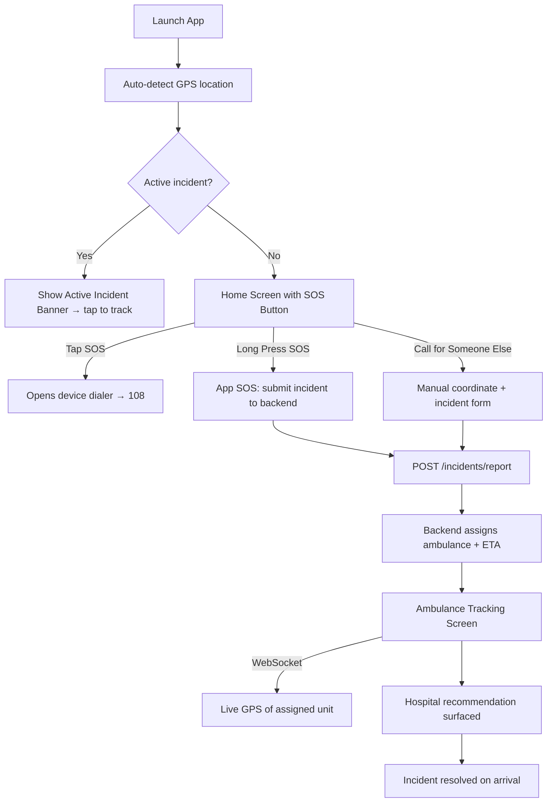
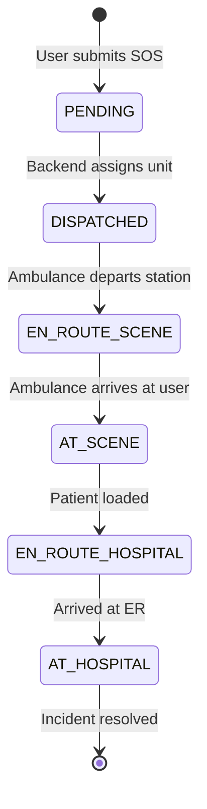

# ResQ — User App
> Emergency SOS & Ambulance Tracking for the Public

[](https://expo.dev)
[](https://reactnative.dev)
[](https://typescriptlang.org)
[](https://nativewind.dev)
[](LICENSE)
[]()

---

## Overview

The ResQ User App is the public-facing mobile application for emergency dispatch. Any civilian in Bengaluru can use it to summon an ambulance, track the assigned unit in real time from dispatch to hospital arrival, and review past incidents.

The app is built on Expo and runs on Android and iOS. It uses the device's GPS for automatic location detection and connects to the ResQ Backend to submit incidents and receive live ambulance telemetry over WebSocket.

---

## Core Problem

| Dimension | Calling 108 Directly | ResQ User App |
|---|---|---|
| Location accuracy | Verbal description, prone to error | Automatic GPS coordinates sent with incident |
| Dispatch visibility | No information after the call | Live ambulance tracking from dispatch to arrival |
| Incident type | Generic emergency | Structured incident type and severity for smarter dispatch |
| Third-party dispatch | Not supported | "Call for Someone Else" flow with manual coordinates |
| Incident history | None | Full history of past incidents and outcomes |

---

## App Flow



---

## Screens

### Home Screen
The primary screen. Shows the user's current detected address in a location pill. A central SOS button is the main call-to-action:
- **Tap** → Opens the device phone dialer pre-filled with `108`. No app dependency required for the core emergency action.
- **Long Press** → Submits a general emergency via the ResQ backend API with the device's GPS coordinates.

A "Call for Someone Else" button allows dispatching to a different location — for bystanders reporting accidents or callers helping someone at a remote address.

Three quick-info cards show nearest hospital, nearby unit count, and average response time.

If an active incident is in progress, a red banner appears at the top of the Home Screen. Tapping it navigates directly to the tracking view.

### Incident Type & Severity Selection (Bottom Sheet)
On long-press SOS, a bottom sheet slides up with two steps:
1. **Incident Type** — choose from CARDIAC, TRAUMA, BURNS, NEURO, GENERAL, and others.
2. **Severity Slider** — drag from 1 (minor) to 5 (life-threatening) and confirm.

These selections are sent with the incident report so the backend can match the optimal hospital by specialty.

### Incident Details & Live Tracking
Once an incident is submitted and an ambulance is dispatched, the user sees:
- Incident ID and type
- Assigned ambulance unit number
- Live ETA countdown updated in real time
- Live map showing the ambulance moving toward the user's location
- Hospital recommendation: name, specialty match, distance
- Status timeline: Dispatched → En Route → Arrived at Scene → En Route to Hospital → Arrived at Hospital

### History Tab
Chronological log of all past incidents submitted from this device, with timestamps, incident types, resolution status, and ETA actuals.

### Settings
Configure the backend URL and notification preferences.

---

## Ambulance Tracking Architecture



The live ambulance position is received over a WebSocket connection. The tracking map component renders a route polyline from the ambulance's current position to the destination (user location or hospital). An ETA countdown is computed from the backend-issued `eta_seconds` value and decremented locally.

---

## Directory Structure

```text
ResQ_User_Frontend/
│
├── app/                          # Expo Router file-based navigation
│   ├── _layout.tsx               # Root layout: fonts, global providers
│   ├── (tabs)/
│   │   ├── _layout.tsx           # Tab bar configuration
│   │   ├── index.tsx             # Home Screen (SOS button, location)
│   │   ├── history.tsx           # Past incidents list
│   │   └── track.tsx             # Live ambulance tracking tab
│   ├── incident-details.tsx      # Full incident detail and tracking view
│   ├── dispatch-other.tsx        # "Call for Someone Else" form
│   ├── onboarding.tsx            # First-launch onboarding
│   └── settings.tsx              # App configuration
│
├── components/                   # Reusable UI components
│   ├── SOSButton.tsx             # Central SOS press/long-press button
│   ├── IncidentTypeSelector.tsx  # Incident type grid for bottom sheet
│   ├── SeveritySlider.tsx        # Severity 1–5 slider with confirm
│   ├── HospitalCard.tsx          # Hospital recommendation card
│   ├── StatusTimeline.tsx        # Incident stage progress indicator
│   ├── LiveAmbulanceTracker.tsx  # Map view with live unit position
│   ├── Toast.tsx                 # Transient error/status toast
│   └── tracking/                 # Sub-components for the tracking view
│       ├── AmbulanceMarker.tsx
│       ├── ArrivalBanner.tsx
│       ├── CompactTrackingView.tsx
│       ├── ETACountdown.tsx
│       ├── ExpandedTrackingView.tsx
│       ├── RecenterButton.tsx
│       ├── RoutePolyline.tsx
│       ├── StepTracker.tsx
│       ├── TrackingProgressBar.tsx
│       ├── TrackingSheet.tsx
│       └── UserLocationMarker.tsx
│
├── hooks/                        # Custom React hooks
│   ├── useLocation.ts            # Device GPS with address reverse geocoding
│   ├── useIncident.ts            # Incident submission state and API calls
│   ├── useAmbulanceTracking.ts   # WebSocket connection + live position state
│   ├── useApi.ts                 # Generic API client hook
│   ├── useWebSocket.ts           # WebSocket lifecycle management
│   └── useSiren.ts               # Plays siren audio on dispatch
│
├── services/
│   ├── api.ts                    # API calls to ResQ backend
│   └── mock.ts                   # Mock data for development without backend
│
├── store/
│   └── appStore.ts               # Zustand global state (active incident, user prefs)
│
├── constants/
│   ├── theme.ts                  # Colour palette and spacing tokens
│   └── config.ts                 # API base URL and env config
│
├── assets/                       # Images, icons, audio
│   ├── logo.png
│   ├── icon.png
│   ├── splash-icon.png
│   └── siren.wav
│
├── app.json                      # Expo app configuration
├── babel.config.js               # Babel + NativeWind preset
├── metro.config.js               # Metro bundler configuration
├── tailwind.config.js            # NativeWind / Tailwind configuration
├── tsconfig.json                 # TypeScript configuration
├── package.json                  # Dependencies
├── .env.example                  # Environment variable template
└── README.md                     # Project documentation
```

---

## Getting Started

### Prerequisites

- Node.js 18+
- Expo CLI (`npm install -g expo-cli`) or Expo Go app on your device
- ResQ Backend running locally or remotely (see `ResQ_backend-main/README.md`)

### Installation

```bash
cd ResQ_User_Frontend
npm install
cp .env.example .env
# configure environment variables (see table below)
npm start
```

### Running on Device / Emulator

```bash
# Android emulator or physical device
npm run android

# iOS simulator (macOS only)
npm run ios

# Web browser (limited functionality)
npm run web
```

Scan the QR code in the terminal with the **Expo Go** app on your phone to run on a physical device without a build step.

### Environment Variables

| Variable | Description | Required |
|---|---|---|
| `EXPO_PUBLIC_API_URL` | ResQ backend base URL (e.g. `http://192.168.x.x:8000`) | No (defaults to localhost) |
| `EXPO_PUBLIC_WS_URL` | WebSocket URL for live tracking | No |

> **Note:** When testing on a physical device, use your machine's LAN IP address instead of `localhost` so the device can reach your local backend server.

---

## Key Dependencies

| Package | Purpose |
|---|---|
| `expo-router` | File-based navigation |
| `expo-location` | Device GPS with permissions |
| `react-native-maps` | Native map rendering for ambulance tracking |
| `@gorhom/bottom-sheet` | SOS type/severity selection sheet |
| `zustand` | Lightweight global state management |
| `nativewind` | Tailwind CSS utility classes for React Native |
| `expo-haptics` | Haptic feedback on SOS submit |
| `expo-av` | Siren audio playback on dispatch |
| `expo-notifications` | Push notifications for dispatch events |

---

## API Endpoints Consumed

| Method | Endpoint | Usage |
|---|---|---|
| `POST` | `/incidents/report` | Submit SOS with GPS coordinates, type, severity |
| `GET` | `/hospital/recommend` | Fetch ranked hospital recommendations by specialty + ETA |
| `GET` | `/fleet/{unit_id}/location` | Fetch live ambulance GPS position |
| `WS` | `/ws/dispatch` | Real-time location and status updates for assigned unit |

---

## Team

| Name | USN | Role |
|---|---|---|
| Akshat Kumar Jha | 1WA24CS031 | Backend Core, Spatial Engine, ML Pipeline, System Architecture |
| Aditya Dadheech | 1WA24CS018 | Backend, ML Pipeline, Data Pipeline, Incident Data Sourcing |
| Arush Mandhan | 1WA24CS054 | Frontend Core, API Integration, Interaction & Response Engineering |
| Aryan Surya K.S | 1WA24CS060 | Frontend, API Integration, Interaction & Response Engineering, Logo Design |

*B.M.S. College of Engineering, Dept. of Computer Science & Engineering, Bengaluru*
*Mobile Application Development — Semester 4, 2026*

---

## Roadmap

- [x] SOS button with 108 dialer fallback
- [x] App SOS with GPS auto-detection
- [x] "Call for Someone Else" dispatch flow
- [x] Incident type and severity selection
- [x] Live ambulance tracking map
- [x] Hospital recommendation surfaced on dispatch
- [x] Incident history tab
- [x] Zustand global state for active incident
- [ ] Push notifications on ambulance arrival
- [ ] Offline SOS queue (submit when connectivity restored)
- [ ] Multi-language support (Kannada, Hindi, Tamil)

---

*ResQ User App is in active development. Contributions, feedback, and questions welcome.*
