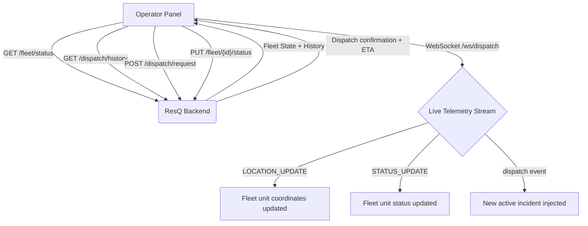

# ResQ — Operator Command Panel
> Real-Time Dispatch Command Centre for Urban Emergency Medical Services

[](https://react.dev)
[](https://vitejs.dev)
[](https://typescriptlang.org)
[](https://leafletjs.com)
[](LICENSE)
[]()

---

## Overview

The ResQ Operator Command Panel is the tactical web dashboard used by 108 dispatch operators to monitor the live ambulance fleet, trigger emergency dispatches, intervene on active incidents, and review the full dispatch audit trail — all from a single unified interface.

The panel consumes the ResQ Backend API and maintains a persistent WebSocket connection to receive real-time telemetry. When the backend is unreachable, the panel degrades gracefully to locally simulated data so operators are never left with a blank screen.

---

## Core Problem

| Dimension | Legacy CAD Dispatch | ResQ Operator Panel |
|---|---|---|
| Fleet visibility | Static table, manual refresh | Live map with real-time GPS telemetry |
| Dispatch trigger | Phone call / radio → operator logs manually | Single-form dispatch with backend API integration |
| Incident intervention | No mid-route swap mechanism | Live unit swap with one click |
| Audit trail | Paper log or disconnected spreadsheet | Persistent dispatch log, filterable by status |
| Backend failure | Full system down | Graceful fallback to local simulation |

---

## Architecture

```
                    ┌──────────────────────────────────┐
                    │    Operator Command Panel (SPA)   │
                    └──────────────┬───────────────────┘
                                   │
          ┌────────────────────────┼────────────────────────┐
          │                        │                        │
    ┌─────▼──────┐          ┌──────▼─────┐          ┌──────▼─────┐
    │  Map View  │          │ Fleet View │          │  Logs View │
    │ (Leaflet)  │          │  Registry  │          │  (Audit)   │
    └─────┬──────┘          └──────┬─────┘          └────────────┘
          │                        │
    ┌─────▼──────┐          ┌──────▼─────┐
    │  Dispatch  │          │  WebSocket │
    │  Wizard    │          │  Manager   │
    └────────────┘          └────────────┘
          │                        │
          └────────────────────────┘
                         │
           ┌─────────────▼───────────────┐
           │      ResQ Backend API        │
           │  REST + WebSocket (/ws/dispatch) │
           └─────────────────────────────┘
```

## Data Flow



---

## Views

### Map View (Radar Map)
The default view. Renders a live CartoDB Dark Matter Leaflet map centred on Bengaluru (bounds: 12.85°N–13.12°N, 77.45°E–77.73°E). Each ambulance unit is plotted by live GPS coordinates. Clicking any location on the map opens the Dispatch Wizard pre-filled with those coordinates and the nearest ward name.

### Fleet View (Vehicle Registry)
A tabular registry of all ambulance units with live status badges: `AVAILABLE`, `DISPATCHED`, `EN_ROUTE_HOSPITAL`, `AT_HOSPITAL`, `RETURNING`, `OFFLINE`. Operators can manually change a unit's status or trigger a new dispatch from any available unit.

### Logs View (Dispatch Audit)
Full chronological log of all incidents. Active incidents can have their assigned unit swapped mid-route (Intervention mode) or resolved by the operator when the crew reports stabilisation.

### Operations Journal (Sidebar)
A persistent side console showing a real-time stream of all system events, fleet changes, and operator actions categorised by `SYS`, `OPS`, `FLEET`, and `EXEC`. Operators can inject custom notes via the command input at the bottom.

---

## Dispatch Wizard

The central operator action. Triggered either by:
1. Clicking a point on the Radar Map → coordinates and ward name pre-filled
2. Clicking "Assign to New Incident" from the Fleet View → unit pre-selected

Fields:
- Emergency type (CARDIAC, TRAUMA, BURNS, NEURO, GENERAL, etc.)
- Severity level (1–10)
- Incident coordinates
- Ward / location name
- Assigned unit (dropdown of available units)

On submit, the panel fires `POST /dispatch/request` to the backend. If the backend responds with a confirmed assignment and ETA, those values override the local estimates. If the backend is unreachable, the panel creates a local incident record with a computed fallback ETA.

---

## Intervention & Resolution

**Mid-route Unit Swap:** If a dispatched unit becomes unavailable, the operator can swap it for any available unit from the Logs View. The old unit is freed to `AVAILABLE` and the new unit is flagged `DISPATCHED`. The backend is updated via `PUT /fleet/{id}/status`.

**Incident Resolution:** When the operator marks an incident resolved (crew reports patient stabilised), the incident status changes to `RESOLVED` and the assigned unit transitions to `RETURNING`.

---

## WebSocket Reconnection

The panel implements exponential backoff reconnection logic for the WebSocket connection. On disconnect, the first retry fires after a short delay; subsequent retries back off exponentially to a cap. The connection status is displayed as a live indicator in the header.

---

## Directory Structure

```text
remix_-resq-operator-panel/
│
├── src/
│   ├── App.tsx                   # Root component: state, WebSocket, all handlers
│   │
│   ├── components/
│   │   ├── MapView.tsx           # Leaflet map with ambulance + incident markers
│   │   ├── FleetView.tsx         # Unit registry table with status controls
│   │   ├── LogsView.tsx          # Incident audit log with swap and resolve actions
│   │   └── NewDispatchForm.tsx   # Dispatch wizard form component
│   │
│   ├── utils/
│   │   ├── backoff.ts            # Exponential backoff for WebSocket reconnection
│   │   └── backoff.test.ts       # Backoff unit tests (Vitest)
│   │
│   ├── data.ts                   # Seed data for fleet units and incidents (fallback)
│   ├── types.ts                  # TypeScript types: FleetUnit, Incident, UnitStatus
│   ├── index.css                 # Global styles and Tailwind base
│   └── main.tsx                  # Vite entry point
│
├── index.html                    # HTML shell
├── vite.config.ts                # Vite + React + Tailwind plugin config
├── tsconfig.json                 # TypeScript configuration
├── package.json                  # Dependencies
├── .env.example                  # Environment variable template
└── README.md                     # Project documentation
```

---

## Getting Started

### Prerequisites

- Node.js 18+
- ResQ Backend running locally or remotely (see `ResQ_backend-main/README.md`)

### Installation

```bash
cd remix_-resq-operator-panel
npm install
cp .env.example .env
# configure environment variables (see table below)
npm run dev
```

The panel starts on `http://localhost:3000` by default.

### Environment Variables

| Variable | Description | Required |
|---|---|---|
| `VITE_API_URL` | ResQ backend base URL (e.g. `http://localhost:8000`) | No (defaults to `http://localhost:8000`) |
| `VITE_WS_URL` | WebSocket URL (e.g. `ws://localhost:8000/ws/dispatch`) | No (defaults to `ws://localhost:8000/ws/dispatch`) |

### Running Tests

```bash
npm run test
```

Runs Vitest in headless mode. Current test coverage targets the backoff utility.

### Production Build

```bash
npm run build
npm run preview
```

---

## Backend Fallback Behaviour

If the backend is unreachable at startup, the panel loads seed data from `src/data.ts` — a realistic set of Bengaluru ambulance units and recent incidents. All dispatch and intervention actions continue to work locally. A warning banner is displayed at the top to indicate the panel is running on simulated data. When the WebSocket reconnects, the warning clears automatically.

---

## API Endpoints Consumed

| Method | Endpoint | Usage |
|---|---|---|
| `GET` | `/fleet/status` | Initial fleet state on load |
| `GET` | `/dispatch/history` | Recent dispatch history on load |
| `POST` | `/dispatch/request` | Submit new emergency dispatch |
| `PUT` | `/fleet/{unit_id}/status` | Manual status change for a unit |
| `WS` | `/ws/dispatch` | Live telemetry: location, status, dispatch events |

---

## Team

| Name | USN | Role |
|---|---|---|
| Akshat Kumar Jha | 1WA24CS031 | Backend Core, Spatial Engine, ML Pipeline, System Architecture |
| Aditya Dadheech | 1WA24CS018 | Backend, ML Pipeline, Data Pipeline, Incident Data Sourcing |
| Arush Mandhan | 1WA24CS054 | Frontend Core, API Integration, Interaction & Response Engineering |
| Aryan Surya K.S | 1WA24CS060 | Frontend, API Integration, Interaction & Response Engineering, Logo Design |

*B.M.S. College of Engineering, Dept. of Computer Science & Engineering, Bengaluru*
*Mobile Application Development — Semester 4, 2026*

---

## Roadmap

- [x] Live Leaflet map with ambulance GPS markers
- [x] WebSocket telemetry with exponential backoff reconnection
- [x] Dispatch wizard with backend API integration
- [x] Mid-route unit swap (Intervention mode)
- [x] Incident resolution flow
- [x] Operations journal with real-time log stream
- [x] Backend fallback to local seed data
- [ ] Voronoi zone mesh overlay on map
- [ ] Demand surface heat-map overlay
- [ ] Multi-city support (Hyderabad, Chennai, Mumbai)

---

*ResQ Operator Panel is in active development. Contributions, feedback, and questions welcome.*
