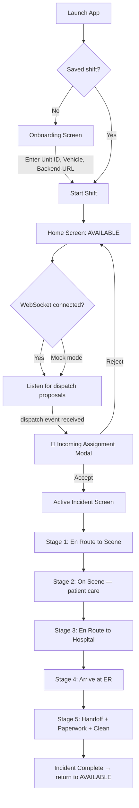

# ResQ — Staff App (Crew / Ambulance)
> On-Device Command App for Ambulance Crews and Paramedics

[](https://expo.dev)
[](https://reactnative.dev)
[](https://typescriptlang.org)
[](https://nativewind.dev)
[](LICENSE)
[]()

---

## Overview

The ResQ Staff App is the on-device application for ambulance crews. Paramedics and drivers use it to start their shift, receive dispatch assignments, navigate to incidents, manage the full incident lifecycle on scene, and view nearby hospital recommendations — all from their mobile device.

The app connects to the ResQ Backend over WebSocket to receive real-time dispatch proposals. When an assignment comes in, the crew hears a siren alert, feels a haptic notification, sees a modal with all incident details and a mini-map, and can Accept or Reject the assignment with one tap.

---

## Core Problem

| Dimension | Radio / Phone Dispatch | ResQ Staff App |
|---|---|---|
| Assignment delivery | Voice call — information can be misheard | Structured modal with incident type, severity, ward, ETA |
| Navigation | Crew uses personal maps app | One-tap navigation launch with incident coordinates |
| Hospital selection | Dispatcher or crew decide ad hoc | Ranked hospital recommendations by specialty, capacity, and ETA |
| Override logging | Not logged | All hospital overrides are recorded |
| GPS telemetry | Manual position reporting | Automatic live GPS push every N seconds |
| Shift state | External log | Shift start/end managed in-app, persisted across sessions |

---

## App Flow



---

## Screens

### Onboarding
Crew configures their shift before going live:
- Unit ID (ambulance number in the fleet)
- Vehicle registration number
- Backend URL (for multi-deployment support)
- GPS polling interval
- Mock mode toggle (for training drills)

Shift state is persisted to `AsyncStorage` so the app survives a phone restart mid-shift.

### Home Screen
Live status dashboard for the active shift:
- Current ambulance status badge: `AVAILABLE`, `DISPATCHED`, `EN_ROUTE_HOSPITAL`, `AT_HOSPITAL`, `RETURNING`, `OFFLINE`
- Status timer (time in current state)
- Live GPS indicator
- Nearby fleet radar — other units visible in the area
- Manual status control buttons
- WebSocket connection indicator (LIVE / DISCONNECTED)

### Incoming Assignment Modal (Full-Screen)
When a dispatch proposal arrives via WebSocket:
- 🚨 Red banner with siren alert and haptic feedback
- Incident type, severity, ward name, and ETA
- Mini-map showing crew location vs. incident location with a route preview
- **ACCEPT & NAVIGATE** → accepts assignment, sets status to `DISPATCHED`, opens native maps app for navigation
- **UNABLE TO RESPOND** → rejects assignment, stays `AVAILABLE`

### Active Incident Screen
Five-stage incident lifecycle management:

| Stage | Label | Key Actions |
|---|---|---|
| 1 | En Route to Scene | Simulated or live route animation on map |
| 2 | On Scene | Timer running, patient assessment notes |
| 3 | Hospital Selection | Ranked hospitals; crew can override recommendation |
| 4 | En Route to Hospital | Route animation to selected ER |
| 5 | At Hospital | Handoff checklist: patient handed, paperwork, vehicle cleaned |

**Hospital Override:** If the crew selects a different hospital than the backend recommendation, the override is flagged and logged. Repeated overrides for a specific hospital feed back into the hospital ranking weights over time.

**Simulation Controls (Mock Mode):**  
For training, the app includes a simulation panel inside the Active Incident Screen:
- Playback speed (0.5× to 5×)
- Play / Pause route animation
- Snap-to-route toggle
- GPS jitter simulation
- Interpolation mode toggle
- Route source: OSRM real road geometry vs. synthetic waypoints

### Hospitals Screen
Fetches and displays all registered hospitals from the backend, sorted by ETA from the crew's current location. Shows specialty tags, ER capacity status, and 24/7 availability.

### History Screen
Full log of all incidents handled by this unit during the current and past shifts.

### Settings
Reconfigure backend URL, toggle mock mode, view device info (model, battery), and manage WebSocket reconnection.

---

## GPS Telemetry

Every N seconds (configurable at shift start), the app pushes the crew's GPS coordinates to `PUT /fleet/{unit_id}/location`. This feeds the live position data consumed by:
- The Operator Command Panel (real-time map)
- The User App (ambulance tracking on the public-facing side)
- The backend dispatch engine (ETA computation for future assignments)

In **Mock Mode**, the app simulates realistic GPS movement: idle drift when stationary, smooth route traversal when en route to a scene or hospital. This allows full end-to-end testing without a physical ambulance.

In **Live Mode**, the app uses `expo-location` with high-accuracy GPS. The crew grants foreground location permissions on shift start.

---

## WebSocket Dispatch

The app connects to `ws://{backendUrl}/ws/dispatch` on shift start. The backend broadcasts `dispatch` events over this channel. The app filters events by `ambulance_id` — only proposals addressed to this unit trigger the assignment modal.

If the WebSocket disconnects, the app reconnects with exponential backoff (capped at 16 seconds). Connection status is shown in the header as LIVE / DISCONNECTED.

In Mock Mode, the WebSocket is bypassed. A demo drill fires automatically 15 seconds after shift start, and a **Simulate Dispatch Drill** button is available on the Home Screen for manual testing.

---

## OSRM Route Integration

When a crew accepts an assignment, the app fetches the actual road route from the OSRM public API:

```
GET https://router.project-osrm.org/route/v1/driving/{lon},{lat};{dstLon},{dstLat}?overview=full&geometries=geojson
```

The returned GeoJSON polyline is interpolated into a smooth sequence of waypoints. The crew's simulated position advances along these waypoints during route animation. If OSRM is unavailable, the app falls back to synthetic straight-line waypoints.

---

## Directory Structure

```text
resq-staff-expo/
│
├── src/
│   ├── types.ts                          # All TypeScript types, enums, mock data
│   ├── utils/
│   │   └── routeHelper.ts               # Synthetic waypoint generation fallback
│   │
│   └── components/
│       ├── OnboardingScreen.tsx          # Shift configuration and start
│       ├── HomeScreen.tsx                # Live status dashboard
│       ├── ActiveIncidentScreen.tsx      # Full incident lifecycle management
│       ├── HospitalsScreen.tsx           # Nearby hospitals ranked by ETA
│       ├── HistoryScreen.tsx             # Incident history log
│       ├── SettingsScreen.tsx            # App configuration
│       ├── ResQMap.tsx                   # Native map with route polyline (mobile)
│       ├── ResQMap.web.tsx               # Web map fallback (Leaflet)
│       └── StitchLogo.tsx               # ResQ logo component
│
├── assets/                               # Images, icons, audio
│   ├── logo.png
│   ├── icon.png
│   ├── splash-icon.png
│   └── siren.wav                         # Dispatch alert sound
│
├── App.tsx                               # Root: shift state, WebSocket, GPS, all handlers
├── index.ts                              # Expo entry point
├── app.json                              # Expo app configuration
├── babel.config.js                       # Babel + NativeWind preset
├── metro.config.js                       # Metro bundler configuration
├── tailwind.config.js                    # NativeWind / Tailwind configuration
├── tsconfig.json                         # TypeScript configuration
├── package.json                          # Dependencies
├── .env.example                          # Environment variable template
└── README.md                             # Project documentation
```

---

## Getting Started

### Prerequisites

- Node.js 18+
- Expo CLI (`npm install -g expo-cli`) or Expo Go app on your device
- ResQ Backend running locally or remotely (see `ResQ_backend-main/README.md`)

### Installation

```bash
cd resq-staff-expo
npm install
cp .env.example .env
npm start
```

### Running on Device / Emulator

```bash
# Android emulator or physical device
npm run android

# iOS simulator (macOS only)
npm run ios

# Web browser (limited map functionality)
npm run web
```

Scan the QR code in the terminal with the **Expo Go** app on your phone to run on a physical device.

### Mock Mode (No Backend Required)

Enable **Mock Mode** in the Onboarding screen. The app will:
- Simulate GPS movement autonomously
- Bypass the WebSocket and fire a demo dispatch drill after 15 seconds
- Allow the full incident lifecycle to be completed without a live backend

This makes the app fully demonstrable on any device, even without a running backend.

---

## Key Dependencies

| Package | Purpose |
|---|---|
| `expo-location` | Real GPS with permission management |
| `react-native-maps` | Native map rendering for route animation |
| `expo-av` | Siren audio on dispatch notification |
| `expo-haptics` | Haptic feedback (assignment, status change, success) |
| `expo-battery` | Battery level display in settings |
| `expo-device` | Device model info for settings panel |
| `@react-native-async-storage/async-storage` | Shift and incident state persistence |
| `nativewind` | Tailwind CSS utility classes for React Native |
| `lucide-react-native` | Icon set |
| `date-fns` | Date formatting for history and shift timers |

---

## API Endpoints Consumed

| Method | Endpoint | Usage |
|---|---|---|
| `PUT` | `/fleet/{unit_id}/location` | Push live GPS coordinates every N seconds |
| `PUT` | `/fleet/{unit_id}/status` | Update ambulance status on state change |
| `GET` | `/fleet/status` | Fetch nearby fleet state for home screen radar |
| `GET` | `/hospital/recommend` | Fetch ranked hospitals at handoff stage |
| `GET` | `/hospital/list` | Full hospital list for Hospitals screen |
| `WS` | `/ws/dispatch` | Receive incoming dispatch proposals in real time |

---

## Team

| Name | USN | Role |
|---|---|---|
| Akshat Kumar Jha | 1WA24CS031 | Backend Core, Spatial Engine, ML Pipeline, System Architecture |
| Aditya Dadheech | 1WA24CS018 | Backend, ML Pipeline, Data Pipeline, Incident Data Sourcing |
| Arush Mandhan | 1WA24CS054 | Frontend Core, API Integration, Interaction & Response Engineering |
| Aryan Surya K.S | 1WA24CS060 | Frontend, API Integration, Interaction & Response Engineering, Logo Design |

*B.M.S. College of Engineering, Dept. of Computer Science & Engineering, Bengaluru*
*Mobile Application Development — Semester 4, 2026*

---

## Roadmap

- [x] Shift onboarding with persistent state
- [x] Real-time dispatch proposal modal with siren + haptic
- [x] Five-stage incident lifecycle management
- [x] OSRM real road route with synthetic fallback
- [x] Hospital ranking and override logging
- [x] Live GPS telemetry push to backend
- [x] Mock mode for training and demos
- [x] WebSocket reconnection with exponential backoff
- [x] Simulation controls for route animation speed and jitter
- [ ] Push notifications when dispatch arrives (background app support)
- [ ] Offline incident queue (complete paperwork without connectivity)
- [ ] Vehicle checklist and maintenance log integration

---

*ResQ Staff App is in active development. Contributions, feedback, and questions welcome.*
